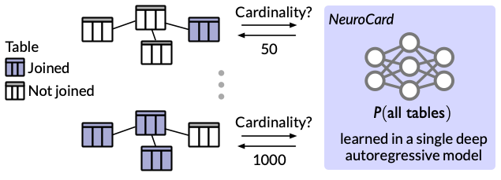

# NeuroCard

<p>
    <a href="http://arxiv.org/abs/2006.08109">
        
    </a>
    <a href="https://github.com/neurocard/neurocard/blob/master/LICENSE">
        
    </a>
</p>

**NeuroCard is a neural cardinality estimator for multi-table join queries.**

<p align="center">
    <br>
    
<p>

NeuroCard's philosophy is to learn as much correlation as possible across tables, thereby achieving high accuracy.

Technical details can be found in the VLDB 2021 paper, [NeuroCard: One Cardinality Estimator for All Tables](http://arxiv.org/abs/2006.08109) [[bibtex](#citation)].

[**Quick start**](#quick-start) | [**Main modules**](#main-modules) | [**Running experiments**](#running-experiments) | [**Contributors**](#contributors) | [**Citation**](#citation)

## Quick start

Set up a [conda](https://docs.conda.io/en/latest/miniconda.html) environment with depedencies installed:

```bash
# On Ubuntu/Debian
sudo apt install build-essential
# Install Python environment
conda env create -f environment.yml
conda activate neurocard
# Run commands below inside this directory.
cd neurocard
```

Download the IMDB dataset as CSV files and place under `datasets/job`:
```bash
# Download size 1.2GB.
bash scripts/download_imdb.sh

# If you already have the CSVs or can export from a
# database, simply link to an existing directory.
# ln -s <existing_dir_with_csvs> datasets/job
# Run the following if the existing CSVs are without headers.
# python scripts/prepend_imdb_headers.py
```

Launch a short test run:
```bash
python run.py --run test-job-light
```

## Main modules

| Module                                                                             | Description                                                                                            |
|------------------------------------------------------------------------------------|--------------------------------------------------------------------------------------------------------|
| [**run**](neurocard/run.py)                                                        | Main script to train and evaluate                                                                      |
| [**experiments**](neurocard/experiments.py)                                        | Registry of experiment configurations                                                                  |
| [**common**](neurocard/common.py)                                                  | Abstractions for columns, tables, joined relations; column factorization                               |
| [**factorized_sampler**](neurocard/factorized_sampler.py)                          | Unbiased join sampler                                                                                  |
| [**estimators**](neurocard/estimators.py)                                          | Cardinality estimators: probabilistic inference for density models; inference for column factorization |
| [**datasets**](neurocard/datasets.py)                                              | Registry of datasets and schemas                                                                       |
| Models: [**made**](neurocard/made.py), [**transformer**](neurocard/transformer.py) | Deep autoregressive models: ResMADE & Transformer                                                      |

## Running experiments

Launch training and evaluation using a single script:
```bash
# 'name' is a config registered in experiments.py.
python run.py --run <name>
```

**Registered configs.** Hyperparameters are statically declared in [**`experiments.py`**](neurocard/experiments.py). New experiments (e.g., changing query files; running hparam tuning) can be specified there.

Configs for evaluation on pretrained checkpoints and full training runs:

| Benchmark        | Config (reload pretrained ckpt) | Config (re-train)                                              | Model       | Num Params |
|------------------|---------------------------------|----------------------------------------------------------------|-------------|------------|
| JOB-light        | `job-light-reload`              | `job-light`                                                    | ResMADE     | 1.0M       |
| JOB-light-ranges | `job-light-ranges-reload`       | `job-light-ranges`                                             | ResMADE     | 1.1M       |
|                  | `job-light-ranges-large-reload` | `job-light-ranges-large`                                       | Transformer | 5.4M       |
| JOB-M            | `job-m-reload`                  | `job-m`                                                        | ResMADE     | 7.2M       |
|                  | -                               | `job-m-large` (launch with `--gpus=4` or lower the batch size) | Transformer | 107M       |

The reload configs load pretrained checkpoints and run evaluation only.
Normal configs start training afresh and also run evaluation.

**Metrics & Monitoring**. The key metrics to track are
* Cardinality estimation accuracy (Q-errors): `fact_psample_<num_psamples>_<quantile>`
* Quality of the density model: `train_bits` (negative log-likelihood in bits-per-tuple; lower is better).

The standard output prints these metrics and can be piped into a log file.  If TensorBoard is installed, use the following to visualize:
```bash
python -m tensorboard.main --logdir ~/ray_results/
```

## Contributors
This repo was written by
* [Frank Luan](https://github.com/franklsf95)
* [Amog Kamsetty](https://github.com/amogkam)
* [Eric Liang](https://github.com/ericl)
* [Zongheng Yang](https://github.com/concretevitamin)

## Citation
```bibtex
@inproceedings{neurocard,
  title={{NeuroCard}: One Cardinality Estimator for All Tables},
  author={Yang, Zongheng and Kamsetty, Amog and Luan, Sifei and Liang, Eric and Duan, Yan and Chen, Xi and Stoica, Ion},
  journal={Proceedings of the VLDB Endowment},
  volume={14},
  number={1},
  pages={61--73},
  year={2021},
  publisher={VLDB Endowment}
}
```
*Related projects.* NeuroCard builds on top of [Naru](https://github.com/naru-project/naru) and [Variable Skipping](http://var-skip.github.io/).
